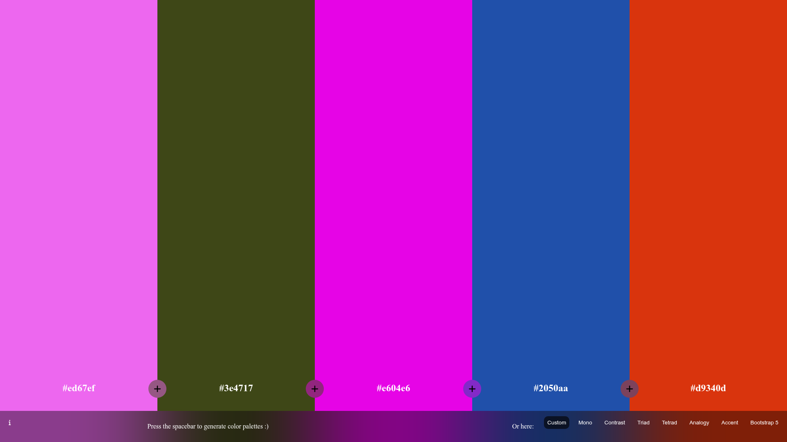

# ColorSwitcher

**Generate, lock and fine-tune color palettes for your next design.**



**[Live demo →](https://anastacodes.github.io/ColorSwitcher/)**

## Features

- Random palette generation — just press the spacebar
- Harmony modes: mono, contrast, triad, tetrad, analogy, accent + a Bootstrap 5 preset
- Per-color lock, shades explorer, eyedropper and one-click copy
- Drag to reorder colors
- Shareable palettes — the current scheme lives in the URL hash
- Built with vanilla JS modules, chroma-js, Webpack 5, ESLint

## Run locally

```bash
npm ci
npm run build     # bundles to dist/
open index.html
```
